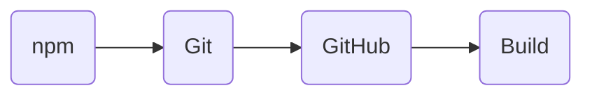
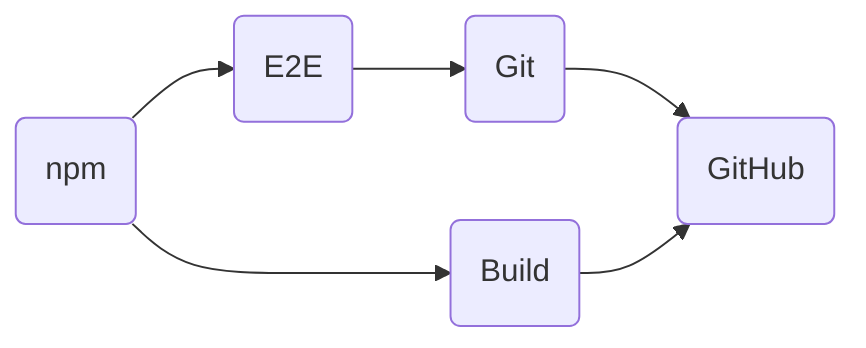

- Feature Name: Update Jest Snap during release process
- Start Date: 2023-04-25

# Summary

[summary]: #summary

Move and rework some release steps to update Jest Snap when we do a release of the CLI while not doubling the release time.

# Motivation

[motivation]: #motivation

When a release of the CLI happens, it currently makes some Jest Snaps outdated causing the tests to fail.

# Guide-level explanation

[guide-level-explanation]: #guide-level-explanation

Our current release process looks like this

1. We release to NPM
2. We create and push a release commit and associated git tags
3. We create a GitHub release for the CLI if needed.[^1]
4. We build the CLI and add the binaries to the GitHub release if needed [^1]

We need the release commit to include the snap udpates to keep the main branch green.
To do so while not hampering our release process too much, our release process would change to look like this:

1. We release to NPM
2. The release process split into two branches:
   - One branch start building the binaries right away.
     - It stores them in a GitHub Job Artifact.
     - It would be a 'noop' if the CLI does not need to be build. [^1]
   - The other branch refreshes the Jest Snap and then proceeds with the release process as before up to the Git commit/push.
3. The creation of the GitHub release now occurs when both Git and the binary jobs are done, and only if the CLI needs to be built/released.

# Reference-level explanation

[reference-level-explanation]: #reference-level-explanation

- Split the Release Workflow into several workflows, one by step
- NPM job would export a git patch so that E2E and Build can continue without any hitches.
- E2E and Git can be one job split into two steps

# Drawbacks

[drawbacks]: #drawbacks

- Potential increase in complexity
- Lack of control over our assertions: a bot will automatically update the Jest Snaps, which are what we 'expect' the code to do. (e.g `expect(something).toMatchSnapshot()`)

# Rationale and alternatives

[rationale-and-alternatives]: #rationale-and-alternatives

- Do nothing: a maintainer will have to update the snap after each release
- Create automatically a PR to update the Jest Snap:
  - Pro: we have more control on our assertions
  - Cons:
    - Daily E2E will fail
    - We lose the 'always green' status of the main branch

# Prior art

[prior-art]: #prior-art

It's really an oddity, I didn't find much prior art.

# Unresolved questions

[unresolved-questions]: #unresolved-questions

# Future possibilities

[future-possibilities]: #future-possibilities

The Snap updater 'job' could be reused on contributors' PR to help resolves merge issues

[^1]: When we do a release, we only releases the packages that have received changes (transitively or not). So if we trigger a release and the releases does not affect the `@coveo/cli` package, then the release process won't 'release' the Coveo CLI, because there'll be nothing to release. It will releases the other packages however.
